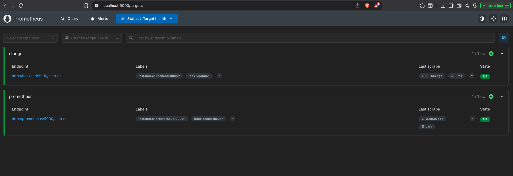
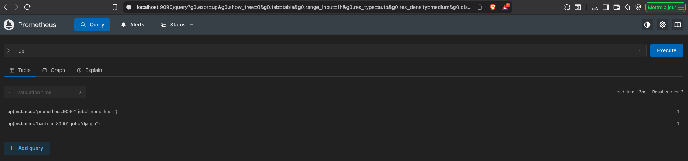
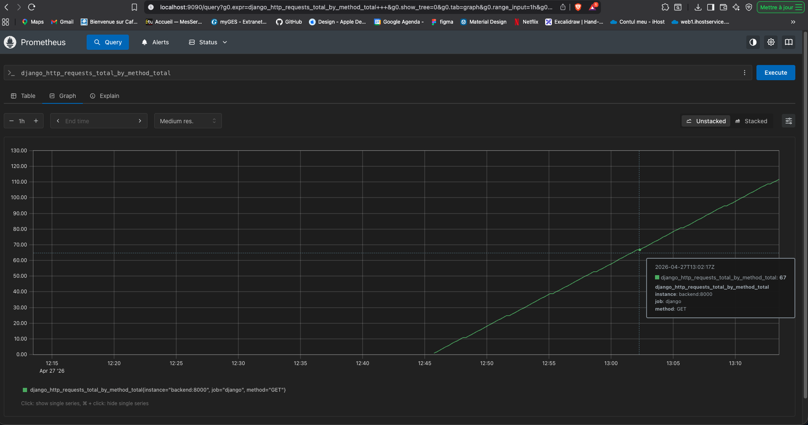
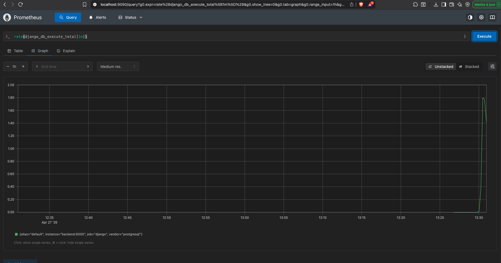
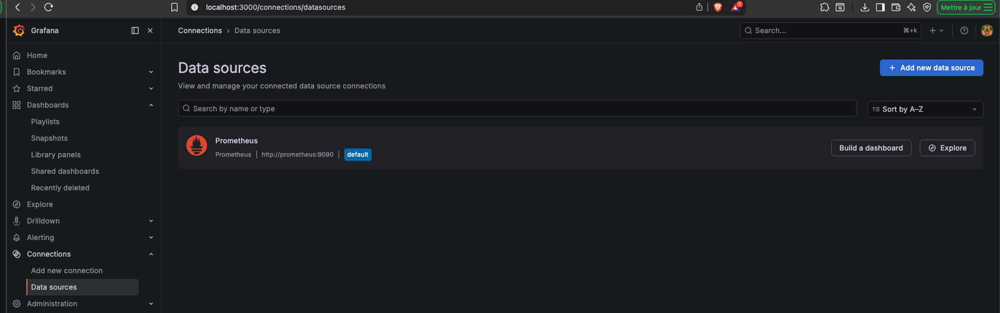
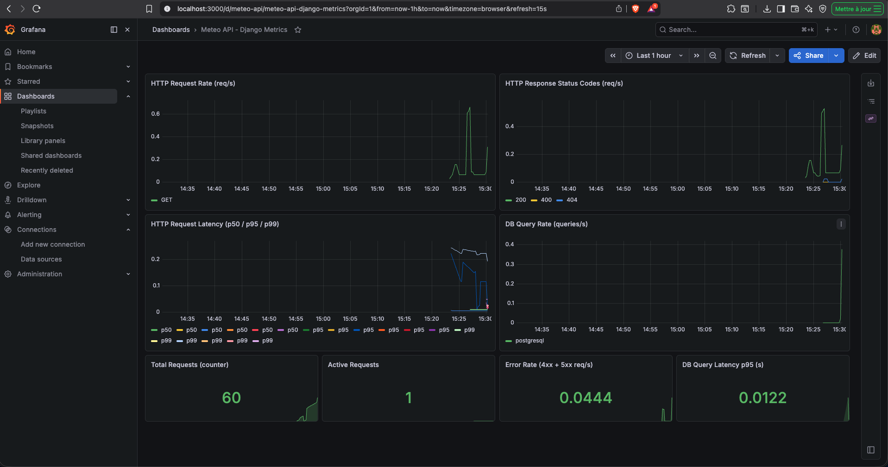

# Deliverables

## CI/CD Pipeline

### Functional pipeline with badge in README

The CI pipeline is defined in `.github/workflows/ci.yml` and runs on every push and pull request to `main`.

Pipeline stages:
- **Backend lint** — Ruff (linter + formatter)
- **Frontend lint** — ESLint
- **Backend tests** — pytest with TimescaleDB service
- **Frontend tests** — Vitest
- **Security scan** — Trivy filesystem scan (backend + frontend)
- **Build** — Docker images for backend and frontend
- **Push** — Images pushed to GHCR on `main` branch only

Badges in README:

[](https://github.com/PhilDaiguille/14_ValorisationDonneeMeteo/actions/workflows/ci.yml)
[](https://scorecard.dev/viewer/?uri=github.com/PhilDaiguille/14_ValorisationDonneeMeteo/)

### Docker images

Images are built and pushed to the GitHub Container Registry (GHCR) on each merge to `main`:

- [14_valorisationdonneemeteo-backend](https://github.com/PhilDaiguille/14_ValorisationDonneeMeteo/pkgs/container/14_valorisationdonneemeteo-backend) — `ghcr.io/phildaiguille/14_valorisationdonneemeteo-backend:latest`
- [14_valorisationdonneemeteo-frontend](https://github.com/PhilDaiguille/14_ValorisationDonneeMeteo/pkgs/container/14_valorisationdonneemeteo-frontend) — `ghcr.io/phildaiguille/14_valorisationdonneemeteo-frontend:latest`

### Test reports

Generated by the CI pipeline and saved to `reports/`:

- `reports/backend-test-report/test-report.xml` — pytest results
- `reports/frontend-test-report/test-report.xml` — Vitest results

### Scan code reports

Generated by the CI pipeline and saved to `reports/`:

- `reports/ruff-lint-report/ruff-report.json` — Python linting (Ruff)
- `reports/eslint-report/eslint-report.json` — JavaScript linting (ESLint)

### Trivy report + VEX file

Trivy scans the backend and frontend filesystems for CRITICAL and HIGH vulnerabilities.

Reports saved to `reports/trivy-reports/`:
- `trivy-backend-report.json`
- `trivy-frontend-report.json`

The VEX file (`vex.openvex.json`) documents the assessment status for each found CVE in OpenVEX format and is used by Trivy (`trivy.yaml`) to filter accepted vulnerabilities from the pipeline.

---

## Prometheus — Metrics UI

Prometheus is configured in `prometheus.yml` and runs as part of the Docker Compose stack. It scrapes the Django backend `/metrics` endpoint (exposed by `django-prometheus`) every 15 seconds.

### Targets UP

Both the `django` and `prometheus` jobs are healthy:





### HTTP request metrics



### DB query rate



---

## Grafana — Dashboard

Grafana runs as part of the Docker Compose stack with a Prometheus datasource provisioned automatically via `grafana/provisioning/datasources/`.

### Prometheus datasource



### Dashboard

The dashboard (`grafana/provisioning/dashboards/meteo_api.json`) includes:

- HTTP Request Rate (req/s)
- HTTP Response Status Codes (req/s)
- HTTP Request Latency (p50 / p95 / p99)
- DB Query Rate (queries/s)
- Total Requests counter
- Active Requests
- Error Rate (4xx + 5xx)
- DB Query Latency p95



---

## Docker Hardened Images (dhi.io)

Both Dockerfiles use hardened base images from [dhi.io](https://dhi.io) instead of standard Docker Hub images, reducing the attack surface in production.

**Backend** (`backend/Dockerfile`):
```
FROM dhi.io/python:3.12-debian12-dev AS builder
FROM dhi.io/python:3.12-debian12
```

**Frontend** (`frontend/Dockerfile`):
```
FROM dhi.io/node:24-alpine3.23-dev AS build
FROM dhi.io/node:24-alpine3.23 AS prod
```

Both use multi-stage builds: a dev image for building/installing dependencies, and a hardened production image for the final artifact.